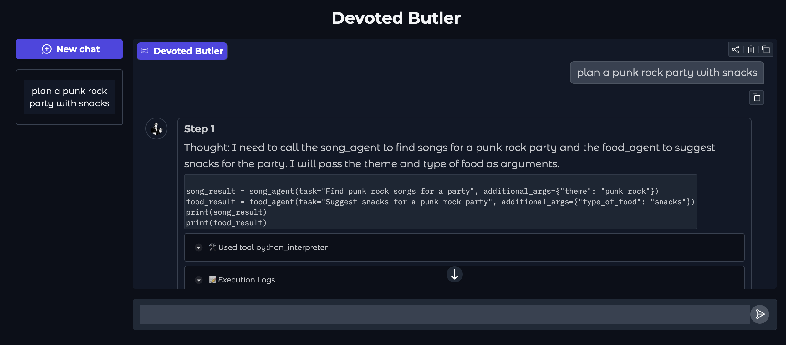

# devoted-butler

A multi-agent party planner behind a Gradio chat UI. A `CodeAgent` manager ("Devoted Butler") fans out to three `ToolCallingAgent` workers in parallel: `song_agent` (iTunes-backed), `food_agent` (hardcoded menus), and `trend_agent` (agentic RAG over DuckDuckGo), then combines their output into one plan.



## Topology

- **Manager** — `CodeAgent` with one tool: `plan_party_in_parallel`. The tool runs all three workers on a `ThreadPoolExecutor(max_workers=3)` and returns the combined Markdown plan. The manager calls the tool once, then `final_answer` with its return value.
- **song_agent** — `ToolCallingAgent` with `find_songs` only. Picks 5 artists that fit the theme, calls `find_songs` once with all names, returns the lines iTunes returned.
- **food_agent** — `ToolCallingAgent` with `suggest_food_menu` only. Calls the tool once and forwards its text as the final answer.
- **trend_agent** — `ToolCallingAgent` with `DuckDuckGoSearchTool`. Agentic RAG: searches live web results for ideas tailored to the theme, then synthesizes a Markdown block with `### Food ideas`, `### Music & vibe`, and `### Setting & decor` sections.

Each worker's `managed_agent` task template is overridden to constrain its reply shape (single tool-call per step, final answer must be a plain Markdown string). The `report` template is also overridden to `{{final_answer}}` so the worker's output isn't prefixed by "Here is the final answer from your managed agent 'X':".

Parallelism is enforced in Python (`plan_party_in_parallel`) rather than left to the model to generate a `ThreadPoolExecutor` block, because a 14B local model isn't reliable at writing concurrent orchestration code.

## UI

`ButlerGradioUI` subclasses `smolagents.GradioUI` to:

- Set a markdown `placeholder` so the empty chat shows instructions (theme, venue, example prompt) instead of a blank pane.
- Wrap `gr.ChatInterface` in `gr.Blocks(theme="soft", css=...)` for a cleaner look and force the avatar to fill the circle (`object-fit: cover`).
- Set the chatbot label and interface title to `"Devoted Butler"`.
- Point `avatar_images` at the local `images/butler.png`.

smolagents requires an agent `name` to be a valid Python identifier, so the manager is `name="devoted_butler"` with the display name in `description`.

`ButlerGradioUI` also overrides `_stream_response` to show a live "Working..." heartbeat with elapsed seconds and one line per worker (`song_agent: running...`, `food_agent: step 1 done`, `trend_agent: done`) while the manager's code block is running. See [docs/streaming.md](docs/streaming.md) for how the thread + queue + step_callbacks interleave works.

## Prerequisites

- Python 3.10+
- [uv](https://docs.astral.sh/uv/) (`brew install uv` or `curl -LsSf https://astral.sh/uv/install.sh | sh`)
- [Ollama](https://ollama.com/) with `qwen2.5:14b` pulled:

```bash
ollama pull qwen2.5:14b
```

## Setup

```bash
uv venv
source .venv/bin/activate
uv pip install -r requirements.txt
```

## Run

```bash
./devoted_butler.sh
```

The script activates `.venv`, starts Ollama if it isn't running, then launches the UI. Gradio prints a local URL. Open it, type a party brief (for example "Plan a villain masquerade party at Wayne's mansion"), and the manager coordinates the three workers in parallel.

## Files

- `devoted_butler.py` — model, tools, workers, manager, `ButlerGradioUI`, Gradio launch.
- `devoted_butler.sh` — launcher.
- `docs/streaming.md` — how the live "Working..." heartbeat works.
- `images/butler.png` — chat avatar.
- `images/butler_screenshot.png` — UI screenshot shown above.
- `requirements.txt` — Python dependencies.
